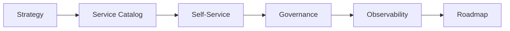

# Framework Overview

## What This Repository Does

This repository provides a practical operating model for building and scaling internal platform capabilities that serve engineering teams.
It treats the platform as a product with users, services, and measurable outcomes.
That means the platform must be usable, observable, and governable as it grows.
The framework is also intended to make the platform story easy to show from the parent MCGR page and related ecosystem pages.

## Platform Flow

## What It Covers

- platform strategy
- internal developer platforms
- self-service workflows
- governance and controls
- platform observability
- engineering productivity

## Who Uses It

- platform engineering teams
- SRE teams
- cloud engineering teams
- architecture leaders
- developer experience teams

## What Good Looks Like

- developers can use the platform without waiting on manual intervention
- platform standards are visible and repeatable
- governance reduces friction instead of adding it
- observability supports both operations and platform improvement
- metrics guide platform investment decisions
- platform users can self-serve common needs with confidence
- platform ownership is explicit

## How To Read It

Start with the strategy page, then move into governance and operating model content.
That sequence keeps the focus on platform behavior first and supporting artifacts second.

## Result

The framework helps teams make platform decisions that improve delivery speed without losing control.

## How To Read It

Start with the strategy page, then move into governance and operating model content.
That sequence keeps the focus on platform behavior first and supporting artifacts second.

## Result

The framework helps teams make platform decisions that improve delivery speed without losing control.

## Outputs

- platform operating model
- self-service patterns
- governance model
- maturity scorecard
- roadmap template

## Platform Layers

| Layer | Question | Artifact |
| --- | --- | --- |
| Strategy | What is the platform for? | Platform engineering strategy |
| Service model | What does the platform offer? | Service catalog / operating map |
| Self-service | What can teams do themselves? | Self-service engineering |
| Control | What requires review? | Platform governance |
| Measurement | How do we know it is working? | Platform KPI dashboard |

## Decision Rule

If a platform capability cannot improve delivery, reduce friction, or clarify ownership, it should not be treated as a first-class platform service.
