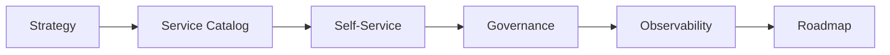

# Platform Operating Map

## Purpose

The operating map shows the main platform services, how they interact, and who owns them.

## Operating Areas

- service catalog
- self-service workflows
- platform support
- observability
- governance
- roadmap management
- intake and prioritization

## Figure

## Use

- map platform capabilities to owners
- identify gaps in service coverage
- make the operating model visible to stakeholders
- use the map as the shared reference for platform scope and ownership

## Outcome

The operating map makes it easier to see how teams use the platform and where the platform should improve next.

## Operating Table

| Area | Owner | Output |
| --- | --- | --- |
| Strategy | Platform leadership | Platform direction |
| Service catalog | Platform team | Published services |
| Self-service | Product/platform team | Self-service workflows |
| Governance | Architecture or control owner | Review path and exceptions |
| Observability | Platform operations | KPI and telemetry view |

## Operating Rule

Platform work should only be treated as mature when teams can see the service, use it without escalation, and measure whether it actually helped.
